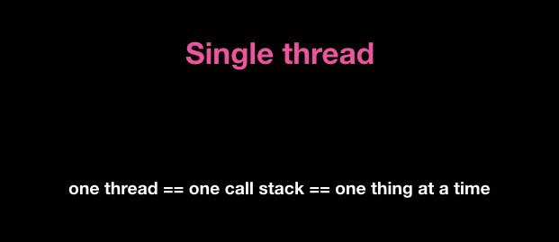

- Introduction
- Why
- What
- How ( When & Where )
- +) Plus

## Introduction

시작하기에 앞서 Call Stack에 대해 아는 것이 없어서 도대체 **왜** 알아야할까 라는 의문부터 생겼다.

## 1) Why?

"왜 콜스택을 알아야 할까?"
개발자들이 정리 해놓은 블로그들을 찾아보니 디테일하게 정리된 곳이 별로 없었다. 다양한 자료와 블로그들의 주요 내용들을 종합해서 알아야 하는 이유에 대해서 차곡차곡 쌓아서 짧게 정리 했다.

기본적인 개념은 함수의 호출 순서를 스택에 기록하고 차례대로 실행시키면서 기록을 제거하는 구조다. 말그대로 함수가 호출되고 실행되는 순서를 알아야 전체적으로 제대로 된 프로그래밍을 구현할 수 있다. 제대로된 프로그래밍이란 JS 엔진의 작동원리와 특성을 이해하고 최적화되고 효율적으로 프로그래밍하는 것이라고 생각한다.

## 2) What?

콜스택은 기본적으로 우리가 프로그램의 진행되고있는 위치가 어디 인지를 기록하는 자료구조다. 임시저장(Temporarily store)의 개념을 이해하면 도움된다. 함수 호출 시 함수, 매개 면수 및 변수가 호출 스택에 push되어 스택 프레임을 형성한다. 이 스택 프레임은 스택의 메모리 위치이며 함수가 스택에서 pop되어 튀어 나오면서 함수가 return되면 메모리가 지워진다.



JS의 가장 큰 특징은 위 그림처럼 싱글 쓰레드로 구성되어 있어서 엔진은 한 번에 한 가지의 일만 한다.  즉, **단일** 호출스택을 갖고있다.


## 3) How? ( When & Where )

어떻게 동작하는지를 공부하면서 언제, 어디서 동작이 되는지 볼 수 있다. 코드는 순차적으로 동기식으로 실행된다.
싱글 쓰레드로써 기본적으로 LIFO(Last in, First out)의 순서로 pop, push로 동작된다.

- 함수(자료)가 호출되는 시점에 call stack에 함수가 쌓이고, 함수의 반환값이 반환되면 call stack에서 함수가 삭제된다.

```JS
function multiply(x, y) {
    return x * y;
}

function printSquare(x) {
    var s = multiply(x, x);
    console.log(s);
}

printSquare(5);
```


## +)plus

### - 단일 호출 스택의 문제점

스택날림(blowing the stack) 콜스택의 최대 크기에 도달했을 때 나타난다. 그리고 재귀함수를 면밀히 테스트 하지 않은 경우 발생한다. 

**<u>Q. 단일 호출 스택인 자바스크립트에서 특정 코드 실행이 늦어지면 어떤 일이?</u>**
:  블록킹된다. 브라우저는 렌더링을 할 수도 없고 다른 코드를 수행할 수도 없이 끼어있는 상황이다. 콜스택내에서 많은 작업을 수행하면서 긴시간동안 응답이 없을 수 있다. 곧 에러를 일으킨다.

**<u>A . 그렇다면 해결방안은?</u>**

비동기 콜백이다! 코드 일부를 실행하고 나중에 실행될 콜백(함수)를 제공한다. 비동기 콜백은 즉시 실행되는 것이 아닌 특수한 시점에 실행되므로 console.log와 같은 동기 함수와는 다르게 스택안에 바로 푸시될 필요가 없다. 

(참고)  비동기는 스택이 아니라면 무엇이 관리하는 것일까?
: 이벤트큐(콜백큐)가 관리한다. 코드가 실행되면서 비동기 함수들(DOM, AJAX, setTimeout…)은 API를 호출하며 콜백함수를 이벤트큐에 밀어 넣는다. 이벤트큐는 대기하다가 스택이 텅비는 시점에 이벤트 루프를 실행한다. (스택에 푸시) FIFO(First in, First out)의 구조로써 첫번째로 들어온 것은 첫번째로 나간다.

정리 하자면  JS는 엔진으로만 구동되는 것이 아니라 비동기 함수들과 상호작용을 한다. 이벤트 루프의 기본 역할은 큐와 스택 모두 지켜보다가 스택이 비는 시점에 콜백을 실행시켜준다라는 것이다.

이상 우리가 콜스택을 알아야 할 이유에 대해서 공부했다.
