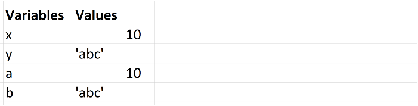

# 3. 값타입, 참조타입

## 1) 값타입

Boolean, null, undefined, String, Number 의 5가지 데이터 유형 값타입이 존재.

-number : C나 Java의 경우, 정수와 실수를 구분하여 int, long, float, double 등과 같은 다양한 숫자 타입이 존재한다. 하지만 자바스크립트는 독특하게 하나의 숫자 타입만 존재한다. 모든 수를 실수를 처리하며 정수만을 표현하기 위한 특별한 데이터 타입(integer type)은 없다.

-string : 첫번째 구문이 실행되면 메모리에 문자열 ‘Hello’가 생성되고 식별자 str은 메모리에 생성된 문자열 ‘Hello’의 메모리 주소를 가리킨다. 그리고 두번째 구문이 실행되면 이전에 생성된 문자열 ‘Hello’을 수정하는 것이 아니라 새로운 문자열 ‘world’를 메모리에 생성하고 식별자 str은 이것을 가리킨다. 이때 문자열 ‘Hello’와 ‘world’는 모두 메모리에 존재하고 있다. 변수 str은 문자열 ‘Hello’를 가리키고 있다가 문자열 ‘world’를 가리키도록 변경되었을 뿐이다. 그리고 문자열은 배열처럼 인덱스를 통해 접근할 수 있다. 이와 같은 특성을 갖는 데이터를 **유사 배열**이라 한다.

## 2) 참조타입

Array, Function, Object 의 3가지 데이터 유형이 참조타입이 존재이며 모두 기술적인 객체다.

참조값이 할당된 변수에는 해당값에 대한 참조가 제공됩니다. 이 참조는 메모리에 있는 객체의 위치를 가리킵니다. 변수는 실제로 값은 포함하지 않습니다.

