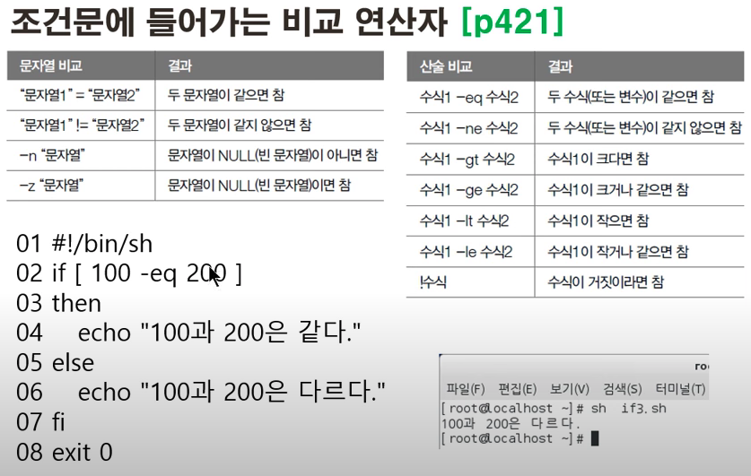
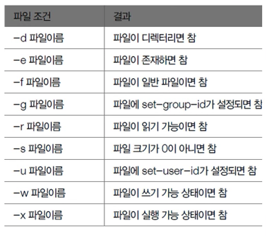

> ## Shell의 기본적인 동작원리

**< Shell -> Kernel -> Hardware -> Kernel -> Shell >**

Shell에게 명령어를 입력시켜주면 Shell은 Kernel이 이해하는 방식으로 해석해서 전달합니다. Kernel이라는 프로그램은 하드웨어를 제어해서 어떠한 처리를 수행할 수 있도록 명령합니다. 그리고나서 하드웨어의 처리 결과를 Kernel -> Shell까지 전달하게 됩니다.

간단히 말해 개발자가 Kernel이 Hardware를 제어하도록 Shell의 명령어를 사용한다는 것입니다.

**Q. 왜 리눅스를 개발할때 Shell과 Kernel을 분리해서 만들었을까?**

Shell은 개발자가 명령한 명령어를 해석하는 프로그램입니다. Kernel은 Hardware를 제어하는 프로그램입니다. 개발자가 사용하기 편한 Shell 프로그램을 선택해서 사용할 수 있는 장점이 있어서 분리했을 것으로 생각합니다.

> ## Shell Script

Shell에서 실행되어야하는 명령어들의 순서를 각본을 짜서 저장해놓은 파일을 Shell Script라고 합니다. 스크립트를 활용하여 자동화된 프로그래밍이 가능합니다.

> 쉘 스크립트 생성

```shell
echo "<내용>" // "<내용>"을 그냥 보여준다.
nano <스크립트 파일> // 스크립트 생성 명령어
chmod +x <스크립트 파일> //실행 가능하도록 실행기능 추가 명령어
./<스크립트 파일> // 파일 실행 명령어
```

> 변수의 기본

모든 변수는 문자열로 취급합니다. 미리 선언하지 않고 값을 할당하면서 선언하도록 합니다. 변수이름은 대소문자를 구분합니다. = 좌우에는 공백이 없어야하고 우측에 공백을 포함시키려면 ""(Double Quote)문자열로 감싸야 합니다.

> 숫자 계산

변수에 들어있는 값을 숫자로해서 사칙연산을 하려면 expr '<내용>'을 사용해야합니다. 수식에 괄호 또는 곱하기는 앞에 역슬래쉬(₩)를 붙여야합니다.

ex)

```shell
num4='expr ₩(\$num1 + 200₩) / 10 ₩\* 2'
```

> 조건문





> if문

```shell
if [ 조건 ]
then
참일 경우 실행
else
거짓일 경우 실행
fi
```

> 반복문

```shell
for 변수 in 값1 값2 값3
do
  반복할 문장
done
```

```shell
while [ 조건 ]
do
  반복할 문장
done
```

> eval

문자열을 명령문으로 인식하고 실행합니다.

> export

외부 변수로 선언해 줍니다. 즉, 다른 프로그램에서 사용할 수 있습니다.
